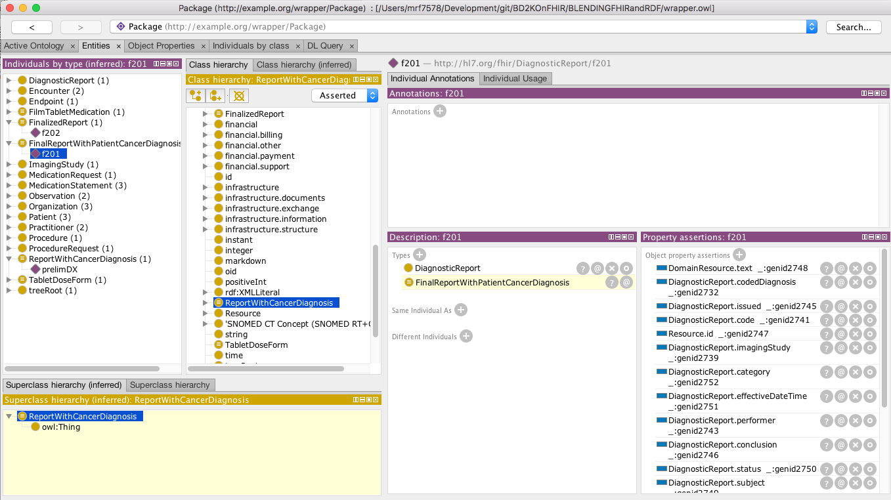
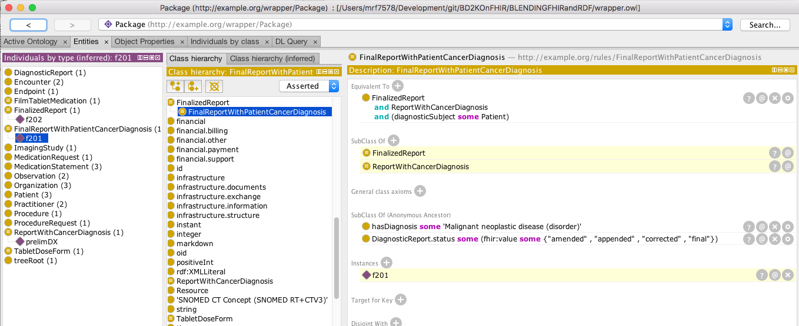

# Source files for [Blending FHIR RDF and OWL](http://www.swat4ls.org/wp-content/uploads/2017/12/paper_28.pdf)

These files can be used to demonstrate the use of FHIR, RDF and SNOMED CT in the context of a Protege.

## Instructions:
1. Clone this project
2. Download the latest version of [Protégé Desktop](http://protege.stanford.edu/products.php#desktop-protege)
3. Copy _catalog-remote.xml_ to _catalog-v001.xml_. This will retrieve the FHIR resources from the [FHIR Build Server](http://build.fhir.org).  (_catalog-local.xml_ is an equivalent that retrives all resources locally).
3. Open ```wrapper.owl``` in Protégé 
4. Select the **Fact++** reasoner from the **Reasoner** tab
5. Select **Start Reasoner ** from the **Reasoner** tab
6. Switch to the Entities tab to see the results



The above image shows ```f201```,a final diagnostic report of a _'188340000 | Malignant tumor of craniopharyngeal duct'_, classified as an instance of ```FinalReportWithPatientCancerDiagnosis```, ```prelimDX```, a preliminary diagnostic report of the same thing classified as a ```ReportWithCancerDiagnosis``` and ```f201```, a final diagnostic report of a _'428763004 | Bacteremia due to staphylococcus|'_ classified as just a ```FinalizedReport```.

Note that ```FinalizedReportWithCancerDiagnosis``` is a subclass of both ```FinalizedReport``` and ```ReportWithCancerDiagnosis```, meaning that ```f201``` is also an instance of both of those classifiers.


## Files
### OWL Files
* **[wrapper.owl](wrapper.owl)**: A wrapper ontology that imports all of the other ontologies needed for classification
* **[fhir.ttl](fhir.ttl)**: the FHIR ontology.  Downloaded from: [http://build.fhir.org/fhir.ttl](http://build.fhir.org/fhir.ttl)
* **[w5.ttl](w5.ttl)**: The FHIR "W5" (Who, What, Why, Where, When) Ontology.  Downloaded from: [http://build.fhir.org/w5.ttl](http://build.fhir.org/w5.ttl)
* **[snomed_subset.ttl](snomed_subset.ttl)**: A small subset of [SNOMED CT](http://www.snomed.org/snomed-ct).  Output of [snomed_subset.sh](snomed_subset.sh)
* **[rules.owl](rules.owl)**: Sample classification rules.
* **[diagnosticreport-example-f201-brainct.ttl](diagnosticreport-example-f201-brainct.ttl)**: Example [FHIR DiagnosticReport](http://build.fhir.org/diagnosticreport.html) of a *188340000| Malignant tumor of craniopharyngeal duct |*. Used to demonstrate *ReportWithCancerDiagnosis* classifier.  Downloaded from: [http://build.fhir.org/diagnosticreport-example-f201-brainct.ttl](http://build.fhir.org/diagnosticreport-example-f201-brainct.ttl)
* **[diagnosticreport-example-f201-prelim.ttl](diagnosticreport-example-f201-prelim.ttl)**: Identical to f201-brainct.ttl with exception that report status was changed from 'final' to 'prelim'.  Used to demonstrate *FinalizedReport* classifier. 
* **[diagnosticreport-example-f202-bloodculture.ttl](diagnosticreport-example-f202-bloodculture.tt)**: Example [FHIR DiagnosticReport](http://build.fhir.org/diagnosticreport.html) of a *|428763004| Bacteremia due to staphylococcus|*.   Example of a diagnostic report that is not about a *363346000| Malignant neoplastic disease |*. Downloaded from: [http://build.fhir.org/diagnosticreport-example-f202-bloodculture.ttl](http://build.fhir.org/diagnosticreport-example-f201-bloodculture.ttl)
* **[imagingstudy-example-xr.ttl](imagingstudy-example-xr.ttl)**: Example [FHIR ImagingStudy](http://build.fhir.org/imagingstudy.html) with the SNOMED code *'T-15460'* changed to *'7467003|Wrist joint structure|'* and *'419161000|Unilateral left|'* changed to *'771000|Left|'*.  Used for demonstration / discussion of post-coordinated model classification. Source: [http://build.fhir.org/imagingstudy-example-xr.ttl](http://build.fhir.org/imagingstudy-example-xr.ttl).
* **[medicationstatementexample1.ttl](medicationstatementexample1.ttl)**: Copy of [http://build.fhir.org/medicationstatementexample1.ttl](http://build.fhir.org/medicationstatementexample1.ttl) with the '''xsd:date''' types changed to '''xsd:dateTime''' because the FaCT++ reasoner chokes on straight dates. Used to demonstrate the *FilmTabletMedication* classifier.
* **[medicationstatementexample1bc.ttl](medicationstatementexample1bc.ttl)**: Copy of [http://build.fhir.org/medicationstatementexample1bc.ttl](http://build.fhir.org/medicationstatementexample1bc.ttl) with the '''xsd:date''' types changed to '''xsd:dateTime''' the dose from changed from *'385057009|Film-coated tablet|*  to *'42162004|buccal tablet|'*.
* **[medicationstatementexample4.ttl](medicationstatementexample4.ttl)**: Copy of [http://build.fhir.org/medicationstatementexample4.ttl](http://build.fhir.org/medicationstatementexample4.ttl) with the '''xsd:date''' types changed to '''xsd:dateTime'''. Used to demonstrate the *TabletDoseForm* classifier.
* **[observation-example-bmd.ttl](observation-example-bmd.ttl)**: Copy of [http://build.fhir.org/observation-example-bmd.ttl](http://build.fhir.org/observation-example-bmd.ttl) with the post-coordinated SNOMED CT expression changed to its OWL equivalent.  
### Ancillary Files
* **[catalog-local.xml](catalog-local.xml)**: An [OASIS XML Catalog](https://www.oasis-open.org/committees/entity/spec-2001-08-06.html) that only references local OWL files. 
* **[catalog-remote.xml](catalog-remote.xml)**: An [OASIS XML Catalog](https://www.oasis-open.org/committees/entity/spec-2001-08-06.html) that references sources from the [FHIR Build Server](http://build.fhir.org) when they haven't been changed locally
* **[snomed_subset.json](snomed_subset.json)**: configuration file used by the [SNOMEDToOWL](https://github.com/hsolbrig/SNOMEDToOWL/blob/master/scripts/SNOMEDToOWL.md) tool to generate the SNOMED CT subset.
* **[snomed_subset.sh](snomed_subset.sh)**: Shell script to generate [snomed_subset.ttl](snomed_subset.ttl)

## Building ```snomed_subset.ttl```
1) Follow the installation instructions on the [SNOMEDToOWL](https://github.com/hsolbrig/SNOMEDToOWL) conversion page.
2) Download the latest image of SNOMED CT International.  The US Download Site can be found at https://www.nlm.nih.gov/healthit/snomedct/index.html -- non US citizens need to consult [SNOMED International](http://www.snomed.org/) for instructions on where to get SNOMED in their country.
3) Run ```RF2Filter``` to extract the desired subset.  In the example below, we extract the RF2 for ancestors and descendants of _'363346000 |Malignant neoplastic disease (disorder)|'_, _'40238009 |Hand joint structure (body structure)|'_ and _'385055001 |Tablet dose form (qualifier value)|'_   into the ```snomed_subset``` directory:
  ```bash
> RF2Filter -i -a -d SnomedCT_InternationalRF2_Production_20170131T120000/Snapshot snomed_subset 363346000 40238009 385055001
```
4) Run ```SNOMEDToOWL``` to generate OWL for the output RF2:
```bash
> SNOMEDToOWL snomed_subset snomed_subset.json snomed_subset.ttl
```
