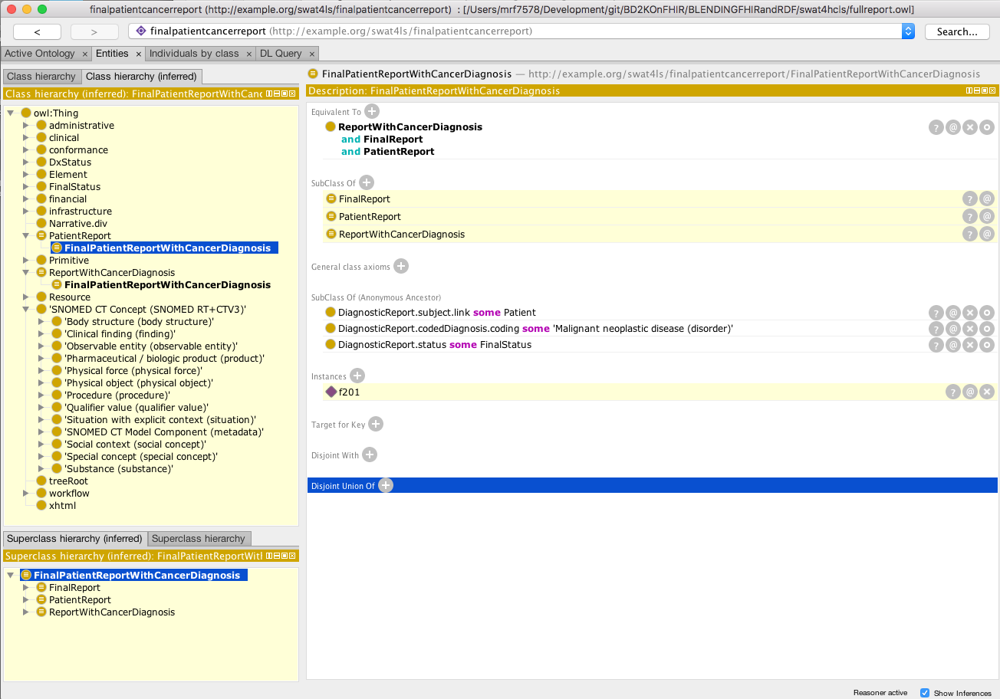

# Blending FHIR RDF and OWL
Supporting materials for swat4hcls 2017 submission #38

## Files
### Core
* [cancerreport.owl](cancerreport.owl) -- class definition for `DiagnosticReport` having a diagnosis of [346325008
|Malignant neoplastic disease|](http://snomed.info/id/346325008)
* [patientreport.owl](patientreport.owl) -- class definition for `DiagnosticReport` whose subject is a reference to a fhir:Patient
* [finalreport.owl](finalreport.owl) -- class definition for `DiagnsosticReport` whose status meets a local definition of "finalized"
* [fullreport.owl](fullreport.owl) -- class definitiion for a finalized `DiagnosticReport` on a patient with a cancer diagnosis

### Support
* [catalog-v001.xml](catalog-v001.xml) -- XML catalog used by Protégé.  This causes all references to be resolved locally
* catalog-v001.backup.xml -- Backup copy of XML catalog as Protégé tends to scribble on these things if you so much
as look at it crosseyed
* [codesystem-diagnostic-report-status.owl](codesystem-diagnostic-report-status.owl) -- proposed OWL representation of the `DiagnosticReport.status` code system
* [fhir.ttl](fhir.ttl) -- FHIR Metadata vocabulary with offending `xsd:date`, `xsd:time`, `xsd:base64Binary` and `fhir:xhtml` data types changed to `xsd:dateTime` and `xsd:string`
* [w5.ttl](w5.ttl) -- local copy of the FHIR 5 W's ontology
* [snomed_subset.ttl](snomed_subset.ttl) -- an OWL representation of the transitive closure and neighborhood of concepts:
  * [18834000 |Malignat tumor if craniopharyngeal duct (disorder)|](http://snomed.info/id/188340000)
  * [394914008 |Radiology - speciality (qualifier value)](http://snomed.info/id/394914008)
  * [429858000|Computed tomography of head and neck (procedure)|](http://snomed.info/id/429858000)
* README.md -- this file

## Use
1. Install a current version of [Protégé](https://protege.stanford.edu) (we use 5.1.0)
2. Clone a copy of the [BLENDINGFHIRandRDF](https://github.com/BD2KOnFHIR/BLENDINGFHIRandRDF) repository
3. Start Protégé and open [fullreport.owl](fullreport.owl)
4. Select the FaCT++ reasoner under the `Reasoner` menu
5. Select `Start Reasoner` under the `Reasoner` menu
6. Navigate to `FinalPatientReportWithCancerDiagnosis` in the `Class Hierarchy` tab and observe that `f201` (the id of
the DiagnosticReport) has been recognized as an instance.

7. Open to the `Individuals by Class` tab, select the first `f201` and note that it has been classified as a `FinalPatientReportWithCancerDiagnosis`.  Note, also, how generally useless the object property assertions are due to the blank nodes...
